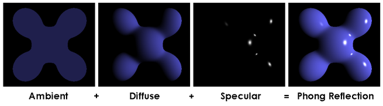

# MiniRT

## 만든이들

jgoo(구재우) / yakim(김양현)

## 프로젝트 소개
Ray Tracing을 활용해 물체를 3D Rendering 하는 과제이다. MiniRT의 주요 목표는 기본적인 수학이나 물리 공식을 활용해 Ray Tracing을 구현하고, 추가적으로 Texture(image, bump map, checkerboard)를 입혀보는 것이다. 우리 프로젝트의 실행 결과는 아래 사진과 같다.


## Ray Tracing이란?
Ray Tracing은 컴퓨터 그래픽스에서 사실적인 이미지 렌더링을 위해 사용되는 기법 중 하나이다. 영화나 애니메이션, 게임 등 여러 분야에서 기본적으로 사용되는 기법이다. 이 기법은 빛의 경로를 추적하여 물체와 상호작용하는 방식을 시뮬레이션한다.

<br>


## 구현 과정

1. 광선 발사: 카메라에서 광선을 발사하여 화면의 각 픽셀에 도달하는 광선을 시뮬레이션
2. 물체와의 교차점 계산: 발사된 광선이 씬(scene) 내의 물체와 교차하는 지점을 계산
3. 빛의 반사 및 굴절: 광선이 물체에 닿으면 반사되거나 굴절되어 다른 물체에 도달할 때까지 추적
4. 조명 계산: 물체의 표면에서 광원의 위치와 광선의 경로를 기반으로 조명과 그림자를 계산
5. 색상 결정: 교차점에서의 조명 정보를 바탕으로 해당 픽셀의 최종 색상을 결정

우리 팀은 Phong Model을 활용하여 3~5 과정을 구현했다. 

## Phong Model
Phong Model은 컴퓨터 그래픽스에서 물체의 표면에 대한 조명과 반사 효과를 시뮬레이션하는 매우 중요한 Lighting 모델이다. 이 모델은 특히 사실적인 하이라이트와 반사 효과를 표현하는 데 유용하다. Phong 모델은 다음 세 가지 주요 요소로 구성된다

1. **Ambient Lighting(주변 조명)**:
   - 씬 전체에 균일하게 퍼져 있는 기본 조명.
   - 주로 씬이 완전히 어두워지는 것을 방지하기 위해 사용됨.

2. **Diffuse Lighting(난반사 조명)**:
   - 빛이 물체 표면에 부딪혀 다양한 방향으로 흩어지는 효과.
   - 물체의 질감과 색상을 강조하며, 빛의 입사각과 표면의 법선 벡터 간의 각도에 따라 조명 강도가 달라짐.

3. **Specular Lighting(정반사 조명)**:
   - 빛이 물체 표면에서 특정 방향으로 반사되는 효과.
   - 물체의 하이라이트를 생성하여 표면이 매끄럽고 반사성이 높음을 표현.
   - 반사된 빛이 관찰자의 시선 방향과 일치할 때 강한 하이라이트가 발생.

<br>



<br>

## Texture Mapping
색상을 결정하는 단계에서 Texture를 입혀서 Rendering 해야 한다면, 해당 교차점을 출력하고자 하는 Texture 내의 좌표로 적절히 변환해야 한다. 물체마다 변환하는 방법이 조금씩 다른데, 결국 공통적인 방법은 0 ~ 1 사이의 값으로 변환하는 것이다.


## 공부하는 데 유용한 사이트
컴퓨터 그래픽스에 대해 더 자세히 알고 싶다면 아래에 링크를 따라가 보는 것을 추천한다.

- [phong lighting model(Opengl)](https://learnopengl.com/Lighting/Basic-Lighting) : pixar에서 일하시는 굉장한 분이 만든 모델을 설명한 사이트. 이 사이트를 참고하여 phong model을 공부했다.
- [ray tracing in one weekend](https://raytracing.github.io/books/RayTracingInOneWeekend.html) : path-tracing 방식을 이용하여 구현하는 법에 대한 설명이 있는 사이트.
해당 방법을 참고하지는 않았지만, 뷰포트 설정이나 광선 충돌에 관한 이론적인 부분에 대해 설명을 잘 해놓았다.
- [texture-mapping](http://raytracerchallenge.com/bonus/texture-mapping.html) : texture mapping을 어떻게 하는지 이론적인 부분을 잘 설명해 놓은 사이트. checker board부터 image mapping까지 다양한 정보에 대해 나와있다.

## 좀 더 이론적인 설명이 궁금하다면
- [Ray Tracing 구현과정](md/RayTracing.md)
- [Phong model](md/Phong.md)
- [Texture-mapping](md/TextureMapping.md) 


## 프로젝트를 직접 테스트 하고 싶다면..

```sh
## macOS 환경이 아니면 실행이 안 될 수 있습니다. 
git clone https://github.com/jasongoo827/MiniRT.git

## 기본 Ray tracing 테스트 (Ambient light, Diffuse light)
make
./miniRT rt/rt파일 (ex ./miniRT rt/sphere.rt)

## Texture, Multi light, 정반사 테스트
make bonus
./miniRT rt/rt파일 (ex ./miniRT rt/earth.rt)

## .d 파일 정리, .o 파일 정리
make clean

## 테스트 한 후에 파일 원래대로 정리
make fclean

```
