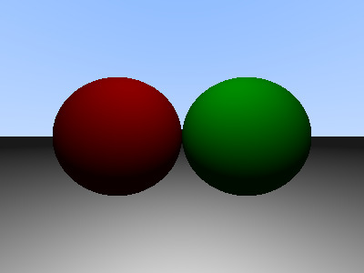

# Phong Model

Phong Lighting Model은 광원에서 빛이 나와서 물체에 반사되어 눈에 들어오는 단계를 수학적으로 계산한다. Phong Lighting Model에 사용되는 중요한 물리학적 기법은 Phong Reflection Model이다. Phong Reflection Model은 광원에서 나온 빛이 물체에 반사되어 나올 때, 그 조도가 어느 정도가 되는지를 구하는 데에 활용되는 모델이다.

Phong 모델은 다음 세 가지 주요 요소로 구성된다

1. **Ambient Lighting(주변 조명)**:
   - 씬 전체에 균일하게 퍼져 있는 기본 조명.
   - 주로 씬이 완전히 어두워지는 것을 방지하기 위해 사용됨.

2. **Diffuse Lighting(난반사 조명)**:
   - 빛이 물체 표면에 부딪혀 다양한 방향으로 흩어지는 효과.
   - 물체의 질감과 색상을 강조하며, 빛의 입사각과 표면의 법선 벡터 간의 각도에 따라 조명 강도가 달라짐.

3. **Specular Lighting(정반사 조명)**:
   - 빛이 물체 표면에서 특정 방향으로 반사되는 효과.
   - 물체의 하이라이트를 생성하여 표면이 매끄럽고 반사성이 높음을 표현.
   - 반사된 빛이 관찰자의 시선 방향과 일치할 때 강한 하이라이트가 발생.


Ray Tracing을 통해 교차점을 구하고, 해당 점에 들어오는 빛의 양(주변광, 난반사 조명, 정반사 조명)을 계산한다.

```c

t_vector	phong_lightning(t_info *info)
{
	t_vector	color;
	t_vector	pl;
	int			i;
	t_light		*light;

	// Ambient Light 계산 - 입력값으로 주어지는 비율만 곱해주면 된다.
	color = vec_scala(info->ambient.color, info->ambient.ratio);
	i = 0;
	// 저장되어 있는 광원을 순회하면 계산한다.
	while (i < info->lightarr->size)
	{
		light = ((t_obj *)(info->lightarr->arr[i]))->ptr;
		// 해당 지점에 그림자가 지면 계산하지 않는다.
		if (check_shadow(info, light))
		{
			i++;
			continue ;
		}
		pl = vec_minus(light->origin, info->record.point);
		normalize_vector(&pl);
		// Diffuse Light 계산
		color = vec_plus(color, diffuse(info, &pl, light));
		// Specular Light 계산
		color = vec_plus(color, specular(info, &pl, light));
		i++;
	}
	color = vec_product(info->record.color, color);
	check_color_bound(&color);
	return (color);
}

```

## 그림자

광원에서 교차점까지 광선을 발사했을 때, 그 사이에 물체가 존재하면 그림자가 생긴다고 할 수 있다.

```c

int	check_shadow(t_info *info, t_light *light)
{
	t_ray		ray;
	t_hit		record_shadow;
	double		t_max;

	init_record(&record_shadow);
	ray.origin = info->record.point;
	ray.dir = vec_minus(light->origin, info->record.point);
	t_max = sqrt(dot(&ray.dir, &ray.dir));
	normalize_vector(&ray.dir);
	ray.origin = vec_plus(ray.origin, vec_scala(info->record.n, 0.001));
	record_shadow = hit_obj(info, ray, record_shadow);

	// 광원 뒤에서 부딪히는 물체는 포함하지 않는다
	if (record_shadow.ishit && record_shadow.t < t_max) 
		return (1);
	return (0);
}

```

## Diffuse Light

```c
// 광원 -> 교점, 카메라 -> 교점 광선 간의 각도를 구해서 곱해준다.
// 각도가 더 작을수록 Diffuse Light가 더 많이 반영된다.

t_vector	diffuse(t_info *info, t_vector *pl, t_light *light)
{
	double		cos;

	cos = dot(pl, &info->record.n);
	if (cos < 0)
		cos = 0;
	return (vec_scala(light->color, cos * light->ratio * DIFFUSE));
}


```

## Specular Light

```c
// 광원 -> 교점, 카메라 -> 교점의 반사광 간의 각도를 구한다. 
// 각도가 작을수록 Specular Light가 더 많이 반영된다.

t_vector	specular(t_info *info, t_vector *pl, t_light *light)
{
	t_vector	v;
	t_vector	dot_nv;
	t_vector	reflect;
	double		cos;

	if (BONUS == 0)
		return (vec4(0, 0, 0, 0));
	v = vec_minus(info->camera.origin, info->record.point);
	dot_nv = vec_scala(info->record.n, dot(&v, &info->record.n) * 2);
	reflect = vec_plus(vec_scala(v, -1), dot_nv);
	normalize_vector(&reflect);
	cos = dot(pl, &reflect);
	if (cos < 0)
		cos = 0;
	return (vec_scala(light->color, pow(cos, SHINE) * SPECULAR * light->ratio));
}


```
### Ambient, Diffuse 적용한 결과



### Specular 까지 적용한 결과

