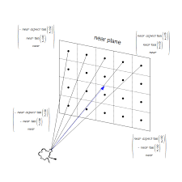

# Ray Tracing

## 구현 과정

1. 광선 발사: 카메라에서 광선을 발사하여 화면의 각 픽셀에 도달하는 광선을 시뮬레이션
2. 물체와의 교차점 계산: 발사된 광선이 씬(scene) 내의 물체와 교차하는 지점을 계산
3. 빛의 반사 및 굴절: 광선이 물체에 닿으면 반사되거나 굴절되어 다른 물체에 도달할 때까지 추적
4. 조명 계산: 물체의 표면에서 광원의 위치와 광선의 경로를 기반으로 조명과 그림자를 계산
5. 색상 결정: 교차점에서의 조명 정보를 바탕으로 해당 픽셀의 최종 색상을 결정

## 광선 발사

### 광선
사과가 빨간색으로 보이는 이유는 무엇일까? 광원으로부터 나온 빛이 사과 표면에 반사된 뒤에, 우리 눈에 들어오기 때문이다. 


광원으로부터 나온 모든 빛이 우리 눈에 들어오는 것이 아니다(햇빛이 다른 나라에 있는 사과를 비춘다고 해서 그것이 우리 눈에 직접 보이진 않는 것처럼). 그러므로 광원으로부터 나온 모든 광선에 대해 조사할 필요가 없다. 우리의 눈에 들어온 광선이 어떤 길을 따라 왔는지만 거꾸로 추적하면 되는 것이다. 그것이 바로 ray tracing의 핵심이다.

```c

typedef struct s_ray
{
	t_vector	origin; // 광선이 출발하는 위치
	t_vector	dir; // 광선의 방향
}	t_ray;

```

### 카메라

이제 우리는 눈에 들어온 광선이 지나온 길을 따라 광선을 역으로 추적해 나갈 것이다. 어떻게 광선을 추적할 수 있을까? 바로 우리의 눈에서 광선이 나간다고 생각을 하는 것이다. 우리의 눈에서 나간 광선이 물체에 반사되고 반사된 광선이 광원에 도착한다면, 그 광선이 광원으로부터 출발해서 물체에 부딪히고 우리 눈에 들어왔다고 생각하는 것이다.

```c

typedef struct s_camera
{
	t_vector	origin; // 카메라 위치
	t_vector	dir; // 카메라가 바라보는 방향
	double		fov; // field of view
	t_vector	horizontal; 
	t_vector	vertical; 
}	t_camera;

```

### 뷰포트 설정

이제 카메라에서 광선이 출발한다고 설정할 것이다. 그렇다면 어느 방향으로 보내야 하는가? 우리는 3차원의 물체를 2차원 평면의 픽셀을 통해 확인할 것이다. 이 때 3차원 장면을 투사하는 가상의 2차원 화면을 뷰포트(viewport)라고 한다.  



이미지와 같이 뷰포트의 모든 픽셀을 향해 카메라에서 광선을 발사할 것이다. 픽셀의 개수는 설정해 놓은 width와 height의 곱으로 정해진다. 

```c

# define WIDTH 1920
# define HEIGHT 1080

typedef struct s_viewport
{
	double		v_height;
	double		v_width;
	t_vector	left_bottom;
}	t_viewport;

typedef struct s_canvas
{
	int		width;
	int		height;
	double	aspect_ratio; // 가로 세로 비
}	t_canvas;

```


### 적용
광선은 뷰포트의 왼쪽 아래부터 오른쪽으로 차례로 발사할 것이다. 

```c

void	set_scene(t_info *info)
{
	t_canvas	canvas;
	t_viewport	viewport;

	get_axis(&info->camera); // 카메라의 수평, 수직 축 설정
	canvas = set_canvas();
	viewport = set_viewport(info->camera, canvas);
	render(info, canvas, viewport);
}

void	render(t_info *info, t_canvas canvas, t_viewport viewport)
{
	int		i;
	int		j;
	double	u;
	double	v;
	t_ray	ray;

	j = canvas.height;
	while (--j >= 0)
	{
		i = -1;
		while (++i < canvas.width)
		{
			u = (double)i / (canvas.width - 1);
			v = (double)j / (canvas.height - 1);
			ray = set_ray(info->camera, u, v, viewport); // 카메라 -> 픽셀 광선 설정
			write_color(info, ray_color(info, ray), canvas.height - j - 1, i);
		}
	}
}

```

## 물체와 교차점 계산

앞에서 카메라로부터 발사된 광선이 물체와 충돌하는지 계산해야 한다. 그 전에 물체에 대한 정의가 필요하다. 과제에서 다루는 물체의 종류는 구, 평면, 원기둥, 원뿔 총 4개이다. 가장 생각하기 쉬운 경우인 구를 예시로 들겠다.

```c

typedef struct s_sphere
{
	t_vector	center;
	double		radius;
	t_vector	color;
}	t_sphere;

```

우리는 광선이 출발하는 점, 광선의 방향을 알고 있으니 직선의 방정식을 만들 수 있다. 또한 구의 방정식도 알고 있다. 이 둘을 연립해서 근이 존재하면, 교점이 있다고 판단할 수 있다. 하지만 이렇게 계산했을 때, 해야 할 연산의 양이 많아질 것이라고 생각했다. 그래서 아래와 같은 방법을 고안했다. 


이처럼 벡터방정식으로 접근한다면 연산의 양이 줄어들 수 있다. 해당 식을 광선의 크기에 대한 2차 방정식으로 풀 수 있게 된다(OC 벡터는 상수, OP 벡터는 광원 + 광선의 방향(단위벡터) * 크기). 교점의 존재 여부는 2차 방정식의 근의 공식을 활용한다.

```c

int	dscrmnt_sp(t_dscrmnt *d, t_ray *ray, t_sphere *sp, t_vector *oc)
{
	// at2 + bt + c = 0 방정식의 판별식
	d->a = dot(&ray->dir, &ray->dir);
	d->b = dot(oc, &ray->dir);
	d->c = dot(oc, oc) - pow(sp->radius, 2);
	d->dscrmnt = d->b * d->b - d->a * d->c;
	if (d->dscrmnt < 0)
		return (0);
	d->root = (-1 * d->b - sqrt(d->dscrmnt)) / d->a;
	if (d->root > 0)
		return (1);
	d->root = (-1 * d->b + sqrt(d->dscrmnt)) / d->a;
	if (d->root > 0)
		return (1);
	return (0);
}

```

해당 과정을 통해 구를 Rendering 할 수 있게 된다. 평면, 원기둥, 원뿔 또한 벡터 방정식을 활용한 판별식을 통해 광선이 물체와 교차하는지 확인할 수 있다. 이 과정을 마쳤을 때 나오는 결과는 아래와 같다.

