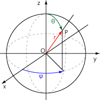

# Texture Mapping

물체에 Texture를 입히려면, Ray Tracing을 통해 구한 교차점이 입히고자 하는 Texture의 어느 위치에 해당하는 알아야 한다. 하지만 교차점은 3차원 좌표인데, Texture는 2차원 이미지 아닌가? 그렇다면 3차원 좌표를 2차원 좌표로 바꾸는 방법에 대해 알아야 한다. 

## Sphere Mapping

구 위의 3차원 좌표 (x, y, z)를 2차원 좌표로 바꾸려면, 구면좌표계에 대해 알아야 한다. 



구면 좌표계는 구 위의 좌표를 r(반지름), Θ, φ 로 표현한다. 위도와 경도로 생각하면 쉽다.
교차점에 대한 정보를 이용해 구면 좌표로 바꿀 수 있다. 단순히 구면 좌표로 바꾸는 것에서 끝나서는 안된다.
0 ~ 1의 값으로 Mapping 해야 그 값에 Texture의 너비나 높이만큼 곱해서 어느 위치인지 맞출 수 있다.

```c

void	sphere_map(t_info *info, double *u, double *v)
{
	double		theta;
	double		radius;
	double		phi;
	double		raw_u;
	t_sphere	*sp;

	sp = (t_sphere *)info->record.obj->ptr;
	theta = atan2(info->record.point.d[X] - sp->center.d[X], \
	info->record.point.d[Z] - sp->center.d[Z]);
	radius = sp->radius;
	phi = acos((info->record.point.d[Y] - sp->center.d[Y]) / radius);
	raw_u = theta / (2.0 * M_PI);
	// 0 ~ 1 사이의 값으로 Mapping
	*u = 0.5 - raw_u;
	*v = 1 - phi / M_PI;
}

```

평면이나 원기둥, 원뿔 또한 마찬가지이다. 특정 좌표계를 통해 변환을 할 수도 있고, 적절히 교차점의 소수부를 가져와서 변환을 할 수도 있다. 핵심은 어떤 방법을 쓰더라도 0 ~ 1 사이의 값으로 바꾸는 것이다. 

### Checkerboard

체커보드는 위의 변환된 좌표가 검정색 부분인지, 흰색 부분인지 판단해주면 된다. 

```c

void	checkerboard(t_info *info)
{
	double	u;
	double	v;
	int		u2;
	int		v2;

	u = 0.0;
	v = 0.0;
	if (info->record.obj->type == SPHERE)
		sphere_map(info, &u, &v);
	else if (info->record.obj->type == PLANE)
		plane_map(info, &u, &v);
	else if (info->record.obj->type == CYLINDER)
		cylinder_map(info, &u, &v);
	else if (info->record.obj->type == CONE) // 원뿔은 원기둥과 같은 변환을 사용했다.
		cylinder_map(info, &u, &v);
	else
		return ;
	u2 = floor(u * 8); // 좌표에 곱해주는 수에 따라 체커보드의 패턴이 바뀐다.
	v2 = floor(v * 8);
	if ((u2 + v2) % 2 == 0)
		info->record.color = vec4(1, 1, 1, 0);
	else
		info->record.color = vec4(0, 0, 0, 0);
}

```


### Image

```c

void	texture(t_info *info, t_uv *uv)
{
	int		u2;
	int		v2;
	int		color;

	if (info->record.obj->type == SPHERE)
		sphere_map(info, &uv->u, &uv->v);
	else if (info->record.obj->type == PLANE)
		plane_map(info, &uv->u, &uv->v);
	else
		return ;
	// 변환된 좌표에 이미지의 너비와 높이만큼 곱해준다.
	u2 = (1 - uv->u) * (info->record.obj->tex.width - 1);
	v2 = (1 - uv->v) * (info->record.obj->tex.height - 1);
	// 이미지 좌표의 색상 값을 가져온다.
	color = info->record.obj->tex.addr[info->record.obj->tex.size_line \
	/ 4 * v2 + u2];
	info->record.color.d[X] = ((color & 0XFF0000) >> 16) / 255.999;
	info->record.color.d[Y] = ((color & 0X00FF00) >> 8) / 255.999;
	info->record.color.d[Z] = (color & 0X0000FF) / 255.999;
}


```


# Bump Map

Bump Map을 입히는 것은 방법이 살짝 다르다. 표면의 울퉁불퉁한 질감을 표현해야 되기 때문에, Rendering되는 표면의 법선 벡터를 적당한 각도로 회전시켜줘야 한다.